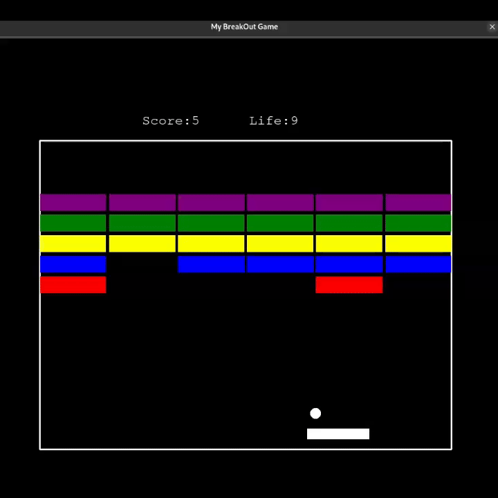

## 🧱 Breakout Game



A classic brick-breaking arcade game built with Python’s `turtle` module.

---

### 🎮 How to Play

* Use the paddle to bounce the ball and break blocks.
* Each time the ball hits a block, you earn points and the ball speeds up.
* You have 10 lives — the game ends when all lives are lost.

#### Controls

* `←` – Move paddle left
* `→` – Move paddle right

---

### ▶️ How to Run

```bash
git clone https://github.com/yourusername/breakoutgame.git
cd breakoutgame
pip install python3-tk
python3 main.py
```

---
